## 1. Titel 

`OnlineStore CH risk-check`

## 2. Kurzbezeichnung

**DE:** Prüft Online-Shops gegen Warnlisten (K-Tipp/Saldo), Reklamationen & auf Trusted Shops Zertifizierung. Ihr Schutz vor Fake-Shops!
**EN:** Checks online shops against warning lists (K-Tipp/Saldo), complaints & for Trusted Shops certification. Your protection against fraud!
**FR:** Vérifie les boutiques sur les listes d'avertissement et la certification Trusted Shops. Votre protection contre la fraude !
**IT:** Controlla i negozi sulle liste di avvertimento e la certificazione Trusted Shops. La tua protezione contro le frodi!

---

## 3. Detaillierte Funktionsbeschreibung (Description)

### Deutsch (DE)
**Sicher einkaufen im Internet – Ihr Schutz vor Fake-Shops und Betrug**

"CH Warnlisten & Shop Risk-Check" ist eine Browser-Erweiterung, die Webseiten und Online-Shops automatisch auf Sicherheitsrisiken analysiert. Die Erweiterung gleicht die aktuelle URL mit bekannten Schweizer Warnlisten ab und nutzt lokale Heuristiken, um Sie proaktiv zu schützen.
"Eine Domain (K-Tipp/Saldo Warnliste, Reklamation.ch, Trusted Shops) wird nur 1x geprüft pro Sitzung im aktuellen- und allen Tabs. Ausser wenn die Prüfung explizit erneut ausgeführt wird."
"Die Safe Browsing wird pro Url 1x ausgeführt."
"Die Prüfung kann automatisch oder manuell eingestellt werden."

"Da ich kein offizieller Entwickler von Ktipp-/Saldo-Warnliste und Reklamation.ch bin, und kein API gefunden werde, wird die Prüfung dort via Web-Aufruf gemacht. Falls sich die Websiten ändern, kann die Funktionalität eingeschränkt sein danach."

"Nach der Installation: 'An Symbolleiste anpinnen' - ansonsten macht es wenig Sinn. Dies kann jedoch nicht automatisiert werden."

**Hauptfunktionen:**
- 🛒 **K-Tipp/Saldo Warnliste:** Überprüft automatisch, ob eine Domain auf der offiziellen K-Tipp/Saldo Warnliste steht.
- - Falls ein Eintrag gefunden wird, wird dieser angezeigt. Der Link öffnet die Warnlisten-Seite, die Domain muss danach jedoch selbst eingetragen werden.
- 🛡️ **reklamation.ch Abgleich:** Sucht nach bestehenden Konsumentenbeschwerden, bevor Sie einkaufen.
- ✅ **Trusted Shops Zertifizierung:** Prüft automatisch, ob der Shop ein gültiges Trusted Shops Gütesiegel besitzt.
- 🔒 **Google Safe Browsing (Optional):** Integration der Safe Browsing API zur Erkennung von Phishing und Malware.
- - Für diese Funktionalität müssen Sie einen API-Key in den Einstellungen hinterlegen. Ein Anleitungs-Link zum erstellen einer solchen ist dort angezeigt
- ⚙️ **Heuristische Prüfungen:** Lokale Erkennung von verdächtigen TLDs, unverschlüsselten HTTP-Verbindungen und URL-Verschleierung – ganz ohne API-Key.
- 🚦 **Sichtbare Warnungen:** Ein Farbsystem im Icon (Badge) und direkte Warnungen auf gefährlichen Seiten informieren Sie sofort.
- 🛡️ **Datenschutz an erster Stelle:** Keine Nutzerverfolgung (Tracking), keine Speicherung von Browserverläufen auf unseren Servern.

**So funktioniert's:**
Wählen Sie zwischen automatischem Scannen beim Surfen oder manuellem Scannen auf Knopfdruck. Fügen Sie vertrauenswürdige Seiten bei Bedarf einer Whitelist hinzu. 

### English (EN)
**Shop Safely Online – Your Protection Against Fake Shops and Fraud**

"CH Warnlisten & Shop Risk-Check" is a browser extension that automatically analyzes websites and online stores for security risks. The extension cross-references the current URL with known Swiss warning lists and uses local heuristics to proactively protect you.
“A domain (K-Tipp/Saldo warning list, Reklamation.ch, Trusted Shops) is checked only once per session in the current tab and all other tabs, unless the check is explicitly run again.”
“Safe Browsing is run once per URL.”
“The check can be set to run automatically or manually.”

“Since I am not an official developer of Ktipp/Saldo-Warnliste or Reklamation.ch, and I haven't been able to find an API, the check is performed via a web request. If the websites change, the functionality may be limited as a result.”

“After installation: ‘Pin to the toolbar’—otherwise, it doesn't make much sense. However, this cannot be automated.”

**Key Features:**
- 🛒 **K-Tipp/Saldo Warning List:** Automatically checks if a domain is listed on the official K-Tipp/Saldo warning list.
- - If an entry is found, it will be displayed. The link opens the warning list page, but you will then need to enter the domain yourself.
- 🛡️ **reklamation.ch Integration:** Searches for existing consumer complaints before you make a purchase.
- ✅ **Trusted Shops Certification:** Automatically verifies if the shop holds a valid Trusted Shops trustmark.
- 🔒 **Google Safe Browsing (Optional):** Integration of the Safe Browsing API to detect phishing and malware.
- - To use this feature, you must enter an API key in the settings. A link to instructions on how to create one is displayed there.
- ⚙️ **Advanced Heuristics:** Local detection of suspicious TLDs, unencrypted HTTP connections, and URL obfuscation – no API key required.
- 🚦 **Clear Alerts:** A color-coded badge icon and direct in-page warnings alert you instantly.
- 🛡️ **Privacy First:** No user tracking, no browsing history stored on our servers.

**How it works:**
Choose between automatic background scanning or manual on-demand scanning. Add trusted sites to your whitelist as needed to optimize performance.

### Français (FR)
**Achetez en toute sécurité en ligne - Votre protection contre les escroqueries**

"CH Warnlisten & Shop Risk-Check" est une extension de navigateur qui analyse automatiquement les sites Web et les boutiques en ligne pour détecter les risques de sécurité. L'extension compare l'URL actuelle avec les listes d'avertissement suisses connues et utilise des heuristiques locales pour vous protéger de manière proactive.
« Un domaine (liste d'alerte K-Tipp/Saldo, Reklamation.ch, Trusted Shops) n'est vérifié qu'une seule fois par session, dans l'onglet actif et dans tous les autres onglets. Sauf si la vérification est explicitement relancée. »
« La fonction Safe Browsing est exécutée une seule fois par URL. »
« La vérification peut être configurée pour s'effectuer automatiquement ou manuellement. »

« Étant donné que je ne suis pas un développeur officiel de Ktipp-/Saldo-Warnliste et de Reklamation.ch, et que je n'ai pas trouvé d'API, la vérification s'effectue via une requête Web. Si les sites Web changent, la fonctionnalité pourrait s'en trouver limitée par la suite. »

« Après l'installation : « Épingler à la barre d'outils » – sinon, cela n'a pas beaucoup d'intérêt. Cela ne peut toutefois pas être automatisé. »

**Fonctionnalités principales :**
- 🛒 **Liste d'avertissement K-Tipp / Saldo :** Vérifie automatiquement si un domaine figure sur la liste officielle de K-Tipp/Saldo.
- - Si une entrée est trouvée, celle-ci s'affiche. Le lien ouvre la page de la liste d'alerte, mais vous devrez ensuite saisir vous-même le nom de domaine.
- 🛡️ **Intégration reklamation.ch :** Recherche les plaintes de consommateurs existantes avant d'acheter.
- ✅ **Certification Trusted Shops :** Vérifie automatiquement si la boutique possède une marque de confiance Trusted Shops valide.
- 🔒 **Google Safe Browsing (Optionnel) :** Intégration de l'API Safe Browsing pour détecter le phishing et les logiciels malveillants.
- - Pour bénéficier de cette fonctionnalité, vous devez enregistrer une clé API dans les paramètres. Un lien vers le guide expliquant comment en créer une y est affiché.
- ⚙️ **Contrôles heuristiques :** Détection locale de TLD suspects et de connexions HTTP non chiffrées sans clé API.
- 🚦 **Avertissements clairs :** Un système de couleurs sur l'icône et des alertes visuelles directes sur les pages dangereuses.
- 🛡️ **Respect de la vie privée :** Aucun suivi des utilisateurs, aucun historique de navigation stocké sur nos serveurs.

### Italiano (IT)
**Acquista in sicurezza online - La tua protezione contro truffe e negozi falsi**

"CH Warnlisten & Shop Risk-Check" è un'estensione del browser che analizza automaticamente i siti Web e i negozi online per individuare rischi per la sicurezza. L'estensione confronta l'URL corrente con le note liste di avvertimento svizzere e utilizza euristiche locali per proteggerti in modo proattivo.
“Un dominio (lista di allerta K-Tipp/Saldo, Reklamation.ch, Trusted Shops) viene controllato una sola volta per sessione nella scheda corrente e in tutte le altre schede, a meno che il controllo non venga esplicitamente ripetuto.”
“Il controllo Safe Browsing viene eseguito una volta per ogni URL.”
“Il controllo può essere impostato in modo automatico o manuale.”

“Poiché non sono uno sviluppatore ufficiale di Ktipp-/Saldo-Warnliste e Reklamation.ch e non ho trovato alcuna API, la verifica viene effettuata tramite una richiesta web. Qualora i siti web subissero modifiche, la funzionalità potrebbe risultare limitata in seguito.”

“Dopo l'installazione: ‘Aggiungi alla barra degli strumenti’ – altrimenti non ha molto senso. Tuttavia, questa operazione non può essere automatizzata.”

**Caratteristiche principali:**
- 🛒 **Lista di avvertimento K-Tipp/Saldo:** Controlla automaticamente se un dominio è presente nella lista ufficiale di K-Tipp/Saldo.
- - Se viene trovato un risultato, questo verrà visualizzato. Il link apre la pagina dell'elenco di avvisi, ma il dominio dovrà poi essere inserito manualmente.
- 🛡️ **Integrazione reklamation.ch:** Cerca reclami preesistenti dei consumatori prima di acquistare.
- ✅ **Certificazione Trusted Shops:** Verifica automaticamente se il negozio possiede un marchio di fiducia Trusted Shops valido.
- 🔒 **Google Safe Browsing (Opzionale):** Integrazione dell'API Safe Browsing per rilevare phishing e malware.
- - Per poter utilizzare questa funzionalità, è necessario inserire una chiave API nelle impostazioni. In quella sezione è presente un link con le istruzioni per crearne una
- ⚙️ **Controlli euristici:** Rilevamento locale di TLD sospetti e connessioni HTTP non crittografate senza alcuna chiave API.
- 🚦 **Avvisi visibili:** Un sistema a colori nell'icona e avvisi visivi diretti sulle pagine pericolose informano immediatamente.
- 🛡️ **Privacy prima di tutto:** Nessun tracciamento degli utenti, nessuna cronologia di navigazione memorizzata sui nostri server.

---

## 4. Screenshots für den Chrome Web Store

Hier sind die erstellten Screenshots der Erweiterung, sortiert nach Kategorien. Diese Bilder können direkt im Entwickler-Dashboard hochgeladen werden!

### Popup & Warnstufen
````carousel
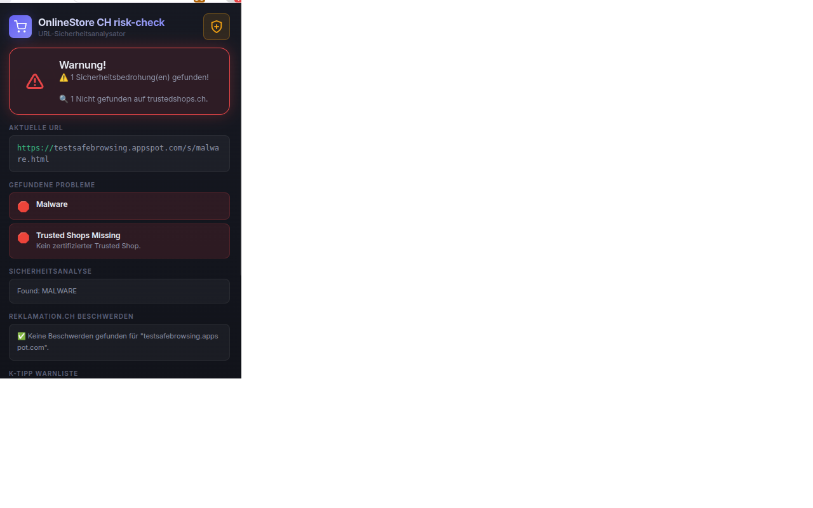
<!-- slide -->
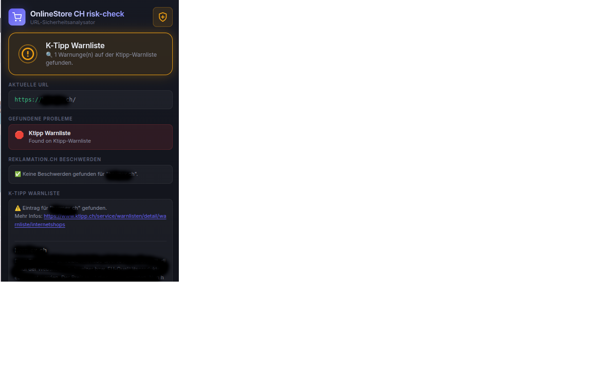
<!-- slide -->
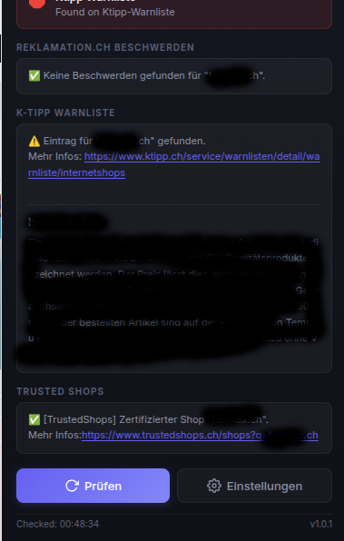
<!-- slide -->
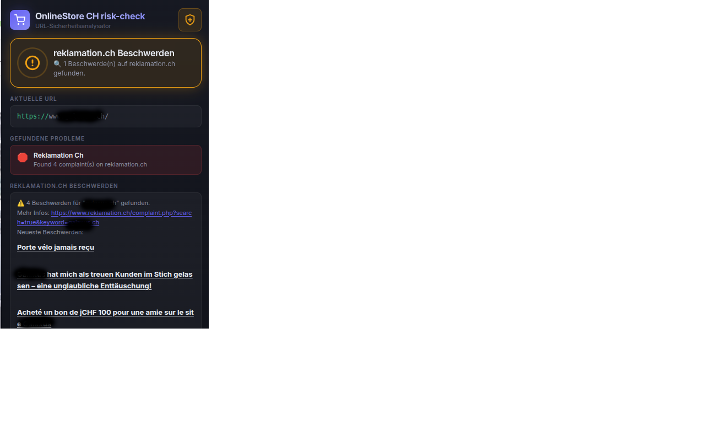
<!-- slide -->
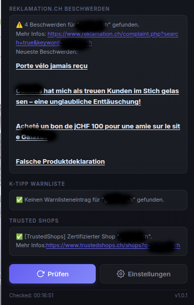
<!-- slide -->
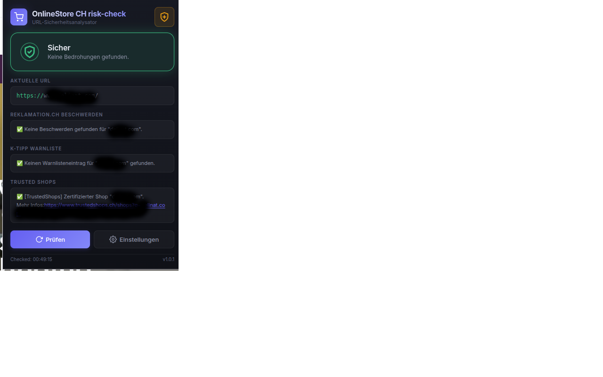
<!-- slide -->
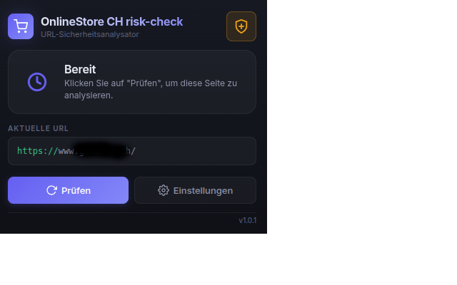
<!-- slide -->
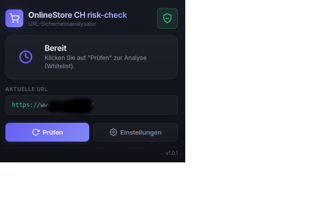
````

### Einstellungen / Optionsseite
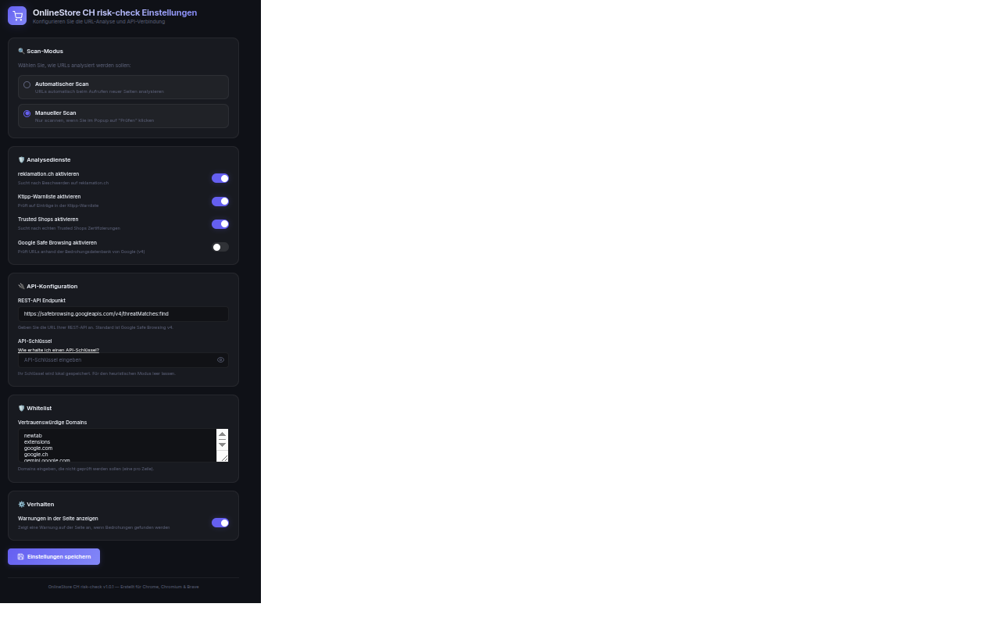

### Symbolleisten-Icons (Badge-Zustände)
````carousel
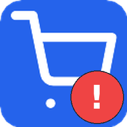
<!-- slide -->
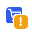
<!-- slide -->
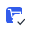
<!-- slide -->
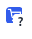
````

---

## 5. Datenschutzerklärung (Privacy Policy)

Diese Datenschutzerklärung müssen Sie z.B. als PDF oder Textdatei auf einer Webseite hosten (z.B. GitHub Pages, eigener Blog) und den Link im Chrome Web Store eintragen.

**Privacy Policy / Datenschutzerklärung**

Zuletzt aktualisiert: 14.04.2026

**1. Einleitung**
Der Schutz Ihrer Privatsphäre ist für uns von höchster Bedeutung. Diese Datenschutzerklärung erklärt, welche Daten bei der Nutzung der Browser-Erweiterung "CH Warnlisten & Shop Risk-Check" erhoben und wie diese verarbeitet werden.

**2. Datenerfassung und -verarbeitung**
Die Erweiterung ist nach dem Prinzip der Datensparsamkeit ("Privacy by Design") entwickelt worden. 
- **Keine Speicherung persönlicher Daten:** Wir speichern weder Ihren Browserverlauf noch personenbezogene Daten oder IP-Adressen auf eigenen Servern.
- **Speicherung von Einstellungen:** Konfigurationen (wie API-Keys, Sprache, Whitelist) werden ausschließlich **lokal** im Speicher Ihres Browsers/Geräts (`chrome.storage.local`) aufbewahrt.
- **URL-Prüfungen im laufenden Betrieb:** Um die Sicherheit einer aufgerufenen Webseite zu bewerten, wird die aktuelle Domain oder URL (je nach Einstellung) an Drittanbieter-Schnittstellen gesendet:
  - *K-Tipp (ktipp.ch/saldo.ch):* Der Domainname wird zur Prüfung gegen die K-Tipp/Saldo Warnliste gesendet.
  - *Reklamation.ch:* Der Domainname wird zur Prüfung auf Konsumentenbeschwerden gesendet.
  - *Trusted Shops:* Die Domain wird über die öffentliche API abgefragt, um den Zertifizierungsstatus zu überprüfen.
  - *Google Safe Browsing (Optional):* Wenn Sie diese Funktion aktivieren und einen API-Key hinterlegen, wird die URL an die Google-Server gesendet. Die Verarbeitung richtet sich nach der Datenschutzerklärung von Google.

**3. Keine Datenweitergabe an Dritte**
Abgesehen von den zwingend notwendigen und temporären Anfragen an die oben genannten Sicherheitsdienste zur Überprüfung der Webseiten (KTipp/Saldo, Reklamation, Trusted Shops, Google), geben wir keine Daten an Dritte weiter, verkaufen diese nicht und tracken keine Verläufe. Die Erweiterung enthält außerdem keine Analysedienste (wie Google Analytics).

**4. Berechtigungen der Erweiterung**
Die Erweiterung benötigt folgende Browser-Rechte, um funktionsfähig zu sein:
- `activeTab`: Um die URL der aktuell geöffneten Seite auszulesen und zu prüfen.
- `storage`: Um Ihre Einstellungen (wie API-Keys, Sprache oder Whitelists) lokal in Ihrem Browser zu speichern.
- `tabs`: Wird für die URL-Prüfung im Hintergrund bei Tab-Wechseln und für die Navigation auf die Einstellungsseite benötigt.
- `host_permissions (<all_urls>)`: Zwingend erforderlich, um Webseiten in die Analyse einzuschließen und Statusmeldungen (Badges, In-Page Warnungen) auf den jeweiligen Seiten platzieren zu können.

